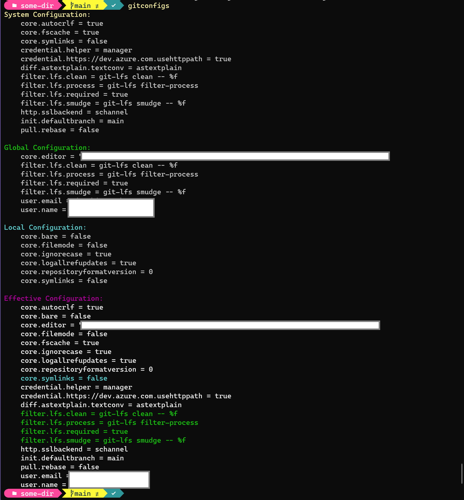

# ShellToys
Interesting or ridiculously over-engineered command-line scripts. 

I wrote these in the script language versions below. Functionality may be a little different in each scripting language.

* PowerShell: 7.4.0 Core
* Bash: GNU bash, version 5.0.17(1)-release (x86_64-pc-linux-gnu)
* Python: 
  * Linux: Python 3.11.2 (main, Mar 13 2023, 12:18:29) [GCC 12.2.0] on linux
  * Windows: Python 3.9.13 (tags/v3.9.13:6de2ca5, May 17 2022, 16:36:42) [MSC v.1929 64 bit (AMD64)] on win32

Git Config Super Listing
A color-coded listing of the git configuration properties for each environment as well as an effective properties section. The effective properties section will show any overridden properties in the color of the section from which they are overridden.

File: [gitconfigs.ps1](gitconfigs.ps1) - Add to $PROFILE

